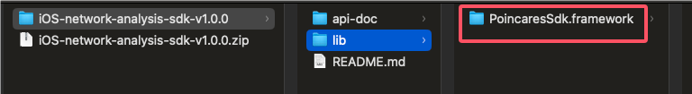
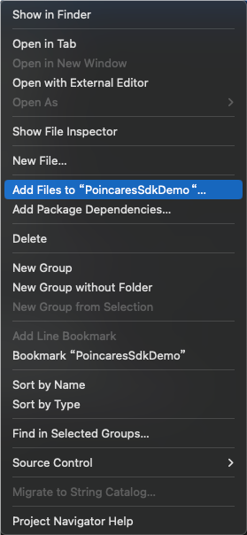
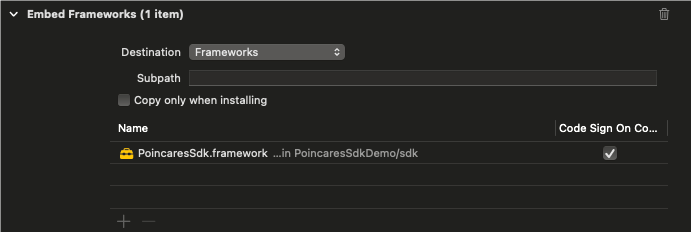

## PoincaresSDK简介

PoincaresSDK是一款有poincares.com发布的网络诊断SDK，它具备ICMP Ping、HTTP、MTR以及TCP Ping多种诊断方式。PoincaresSDK配合服务器端的大数据分析与挖掘，向用户提供详尽全面的网络状况分析与诊断，可为用户网络选型提供有力的决策依据。

<br /><br />

## 1. 前置准备

### 1.1 SDK下载

地址：https://sdk-release-prod.oss-cn-hangzhou.aliyuncs.com/iOS-network-analysis-sdk-v1.0.0.zip

<br />

### 1.2 SDK的导入

上述zip解压后，lib目录下有PoincaresSdk.framework，如下：



将整个PoincaresSdk.framework copy到本地工程中，并选择"Add Files to......"，将SDK的framwork添加到xcode工程中，如下：



并在app工程的build phase选项里，确保PoincaresSdk.framework已被选择为Embed方式，如下：



<br />

### 1.3 准备AppKey/AppSecret

在使用SDK前，需先在[官网](https://www.poincares.com)申请AppKey以及AppSecret。并替换demo PoincaresSessionWrapper中的全局变量：

```objective-c
NSString* gAppKey	   = @"to apply on www.poincares.com";
NSString* gAppSecret = @"to apply on www.poincares.com";
```

<br /><br />

## 2. iOS SDK API使用说明

SDK核心类是PoincaresSession，用户可通过PoincaresSession来进行网络侦测的各项操作。

### 2.1 PoincaresSession创建

```objective-c
+ (instancetype)sharedSessionWithAppKey : (NSString*) appKey
                          withAppSecret : (NSString*) appSecret
                             withAppTag : (PoincaresAppTag*) appTag
                withSchedulingServerUrl : (NSString*) url
                   withOpeationObserver : (id<PoincaresOperationObserver>) observer;
```

通过上述`PoincaresFactory`的静态方法获取一个Session实例。

appKey ：是用于集成本SDK的Application标识，可在poincares.com官网申请。

appSecret：会在官网申请appKeys时一并分配。

appTag：该形参所涉及到的数据结构类NDAppTag，主要是对app的一些附属描述，以方便用户在进行数据分析时的多app辨识。详情可以参阅SDK API Doc

url：是调度服务器地址，SDK在拉取app用户在所配置的探测任务配置时，需要用到。Poincares Tech Sys. 由端侧和服务器侧两部分组成，用户在管理系统上配置好各种网络侦测任务。SDK启动时，从服务器拉取配置任务，然后启动并执行各种网络侦测任务。

observer：是操作回调。PoincaresSDK 除了stop，其他接口都是异步接口。因此针对PoincaresSession的某项调用（比如start()调用）最终的调用结果，会通过该observer反馈给应用层。在实现该delegate时，请特别留意，请勿在回调里运行重负载操作。建议，可以将回调的信息抛到其他线程做进一步处理。详情，可以参阅Demo。有关作用在Session上的各种Operation的具体类型可参与SDK API Doc中PoincaresDef.h - PoincaresOperationType部分说明。

<br />

### 2.2 PoincaresSession启动

获取到Session实例后，即可进一步调用以下接口：

```objective-c
int err = [_session start];
```

Session的start接口只做内部基本校验。如果基本校验未通过，也会有错误码返回。基本校验通过将返回0，表示无错误。最终的start行为的成败，将通过异步NDOperationObaserver通知app层。

通过Session的start()接口，启动网络侦测。sdk会连接之前的schedulingServerUrl地址，拉取任务配置，并启动相应任务。

<br />

### 2.3 PoincaresSession停止

相应的停止接口为:

```objective-c
- (int) stop;
```

<br />

## 3. 相关链接

[App Demo示例](https://github.com/gimphammer/poincaressdk-iOS-demo)
